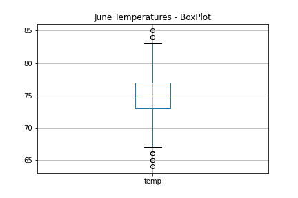
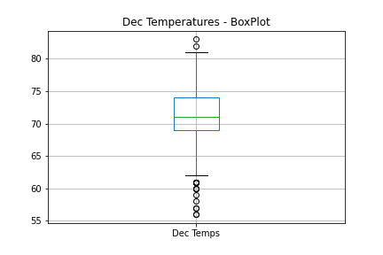
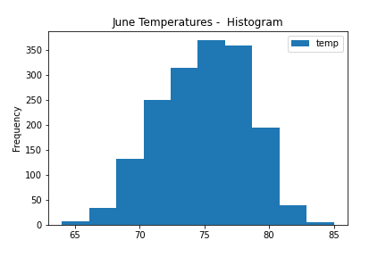
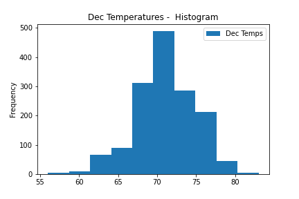

# Weather analysis - Business Case for a Surf and Shack Shop

## Project Overview:
Opening up a Surf & Shack Shop , which will serve surf board and ice cream to locals and tourist. Business plan has been reviewied with an investor. Investor is very interested in the idea due to strong business case and their own passion.

However based on past experiance, investore require deeper analysisn on weather data pertaining to the derie location and evlauate the risk of rain throughout the year.

The analysis is going to be shared with investors and obecitve it that it can be easily repeatable for other potenital lications for a quick decision making process.

## Challenge:

- Deliverable 1: Determine the Summary Statistics for the temperature observatiosn from the month of June
- Deliverable 2: Determine the Summary Statistics for the temperature observatiosn from the month of December

## Resources:

#### Data:
- Weather data - Measurements
	Weather obseravations for Oahu island in Hawaii.
- Weather Station information used to collect weather measurements.
	
- Link to the weather data in "SQLITE" format [Oahu Weather Data](hawaii.sqlite)

#### Software:
Software: Anaconda Jupyter notebook Python 3.7 , pandas, SQLAlchemy 

## Results:
1 Average Temperature in Jun is 4 degress Fahrenhit higher than Dec average temparture
2 Jun Temperature Stats:

       Jume Temps
   count	1700.000000
   mean	74.944118
   std	3.257417
   min	64.000000
   25%	73.000000
   50%	75.000000
   75%	77.000000
   max	85.000000
   
3. Dec Temperature Stats:
    Dec Temps
  count	1517.000000
  mean	71.041529
  std	3.745920
  min	56.000000
  25%	69.000000
  50%	71.000000
  75%	74.000000
  max	83.000000

## Summary:
1  December is colder than June.
2. December has less obsearvation compares to June.
3. IQR for June is 4 degress while for Dec is 5 degress
4. Both Jun and Dec has few outliers outside of the IQR boundaries

### June Box Plot:

### Dec Box Plot:

### June Histograms:

### Dec Histograms:

5. We can further reduce the analysis to only station number USC00519281 ,which has the most observations throughtout the year.

- June query:
			june_temp = session.query(Measurement.tobs).\
            				filter(func.strftime("%m",Measurement.date) == "06").\
					filter(Measurement.station == 'USC00519281' ).all()

- Dec query:
			dec_temp = session.query(Measurement.tobs).\
            			filter(func.strftime("%m",Measurement.date) == "12").\
				filter(Measurement.station == 'USC00519281' ).all()

